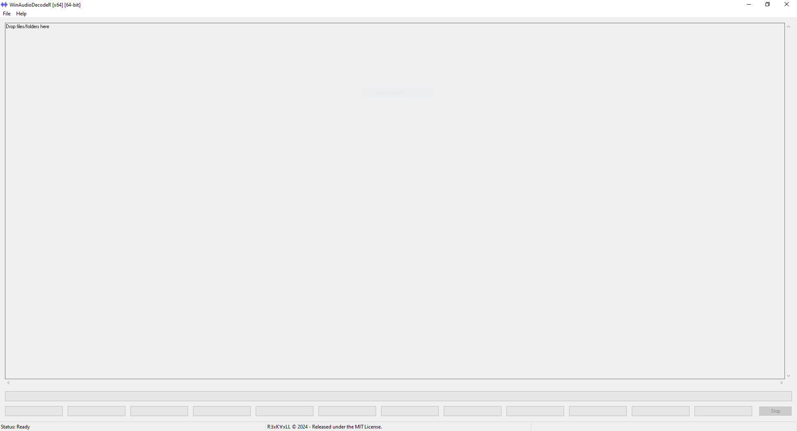
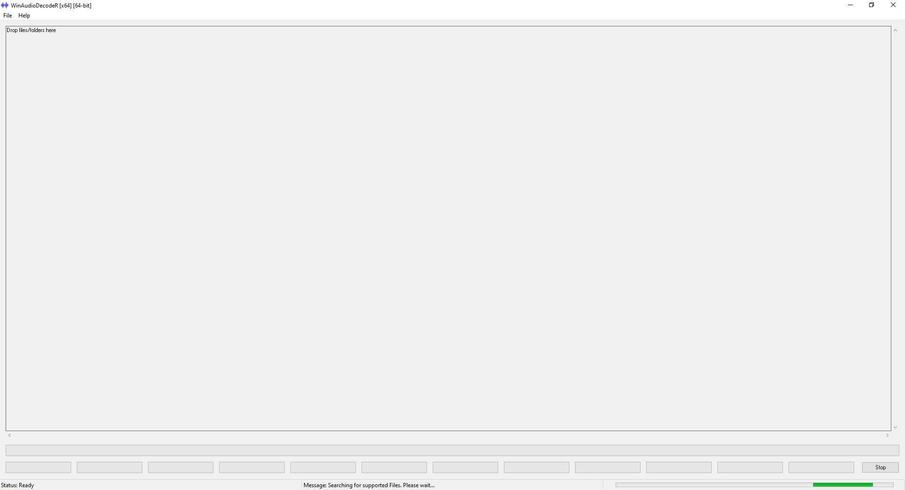
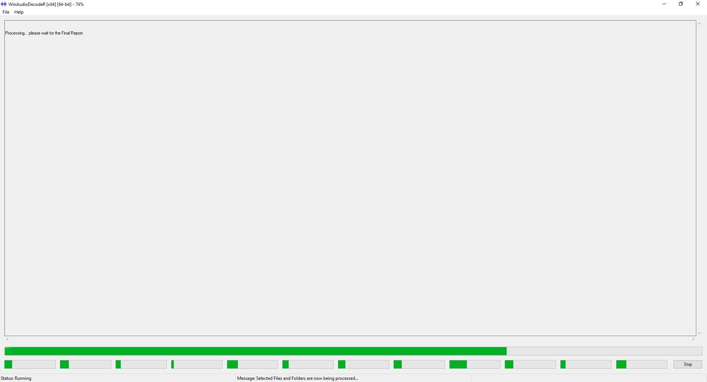

<h1 style="text-align: center;">WinAudioDecodeR</h1>

    

    <a href="https://github.com/R3xK4xLL/WinAudioDecodeR/releases/latest">Download Latest</a>

## Description

WinAudioDecodeR is a multi-threaded GUI desktop application, that supports bulk-decoding of audio files, detection of file errors and other problems encountered, and the generation of a final report for the user.

A great tool for music fans and collectors that would like additional insights into the quality and state of the files within their digital music collections.

## Features

- Supports high performance multi-threaded decoding of files.

- Supports simple Drag-and-Drop processing of files and folders.

- Supports processing files and folders located on Network Shares and Mapped Network Drives.

- Supports a wide-range of Use cases; from processing a few files to processing many thousands of files. 
    
    - Great for users with small or very large collections of supported files types.
    
    - Entire collections can be scanned, decoded, and checked for errors or problems.

- Supports a variety of popular file types including: FLAC, MP3, WavPack, and Ogg-Vorbis.
    
    - Supports WavPack encoded DSD files, including MD5 Checksum verification.

- Supports searching large folder structures for supported file types, while maintaining a responsive UI.

- Supports user-controlled stopping of decoding tasks or searches of folder structures.

- Files are processed in **_read-only mode_**. The Application will **NOT** write to or modify the decoded files in any way, ensuring that your files are safe from modification.

## Technical Features

- Written in C/C++ for maximum performance.

- Coded to directly uses the Native Windows Operating System API (a.k.a. WinAPI or Win32 API).
    
    - The [WinAPI](https://en.wikipedia.org/wiki/Windows_API) is the lowest-level of interaction between Applications and the Windows Operating System (except for Device Drivers which are even lower-level).

- GUI Widgets are implemented with the Common Controls Library version 6.0.0.0.
    - Common Controls Library is the native Windows OS Widget toolkit.

- Multi-core Processing support:
    
    - Each file is loaded entirely into Memory (RAM) and assigned its own Thread and Logical Core, during the decoding process, for maximum performance.
       
      - Can process up to 64 Files simultaneously, utilizing a maximum of 64 Logical Cores in the 64-bit build.
       
      - Can process up to 32 Files simultaneously, utilizing a maximum of 32 Logical Cores in the 32-bit build.
      
- Uses multi-threading to support asynchronous background searching of large folder structures for supported file types.

- Supported on Windows 7/8/10/11 for both 64-bit and 32-bit builds.

## Screenshots

#### Ready for processing:

    

#### Searching for files:

    

#### Decoding multiple files:

    

## Release Notes

See the [Changelog](docs/CHANGELOG.md).

## Documentation

### Error Message Guide ###

See the [Error Message Guide](docs/ERROR-MESSAGE-GUIDE.md) for additional information about the Error Messages shown in the Final Report.

### Build Guide ###

The Projects within the Solution use vcpkg as their Package Manager and therefore the Visual Studio environment must be configured to support vcpkg.

See the [vcpkg Installation Guide](docs/VCPKG-INSTALLATION-GUIDE.md) for additional information about configuring vcpkg Package Manager support for Visual Studio.

## License

WinAudioDecodeR is licensed under the MIT license - see the [LICENSE](docs/licenses/LICENSE.txt) file for details.

## Development Notes

More information about the Project Background and the Project Goals.

See [Development Notes](docs/DEVELOPMENT-NOTES.md) for details.

## Credits

AudioTester is Copyright © James Chapman
http://www.vuplayer.com

Ogg Vorbis is Copyright © Xiph.Org Foundation
https://xiph.org/vorbis/

FLAC is Copyright © Josh Coalson, Xiph.Org Foundation
https://xiph.org/flac/

WavPack is Copyright © David Bryant
https://www.wavpack.com/

MD5 License is Copyright © L. Peter Deutsch, Aladdin Enterprises
ghost@aladdin.com

## Students and Learning

For students or self-taught learners.

This codebase has been documented extensively with verbose comments and highly readable variable and function names.

If you are new to, or interested in learning how an actual multi-threaded WinAPI GUI Application is written, and would like to be less confused during the learning process. Then feel free to analyze and use this codebase for that purpose. Perhaps the effort I put into learning how this codebase works and documenting it, will assist you in learning it more quickly.